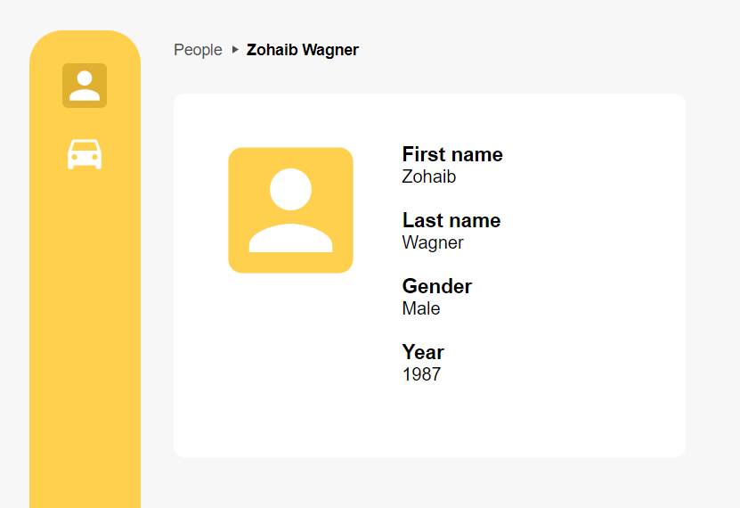
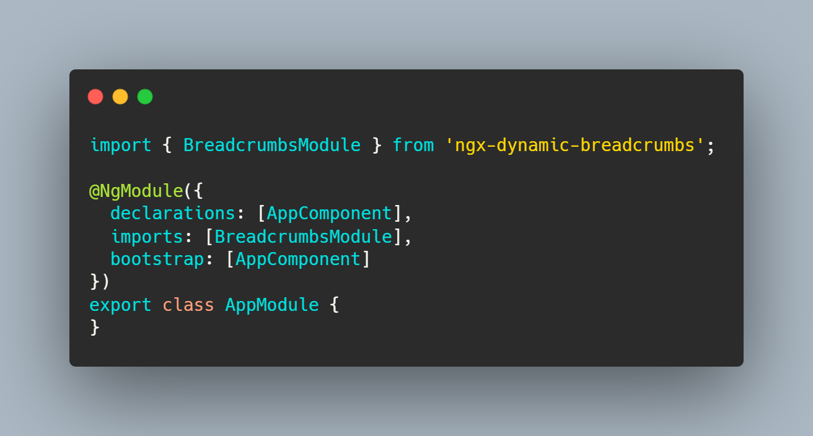
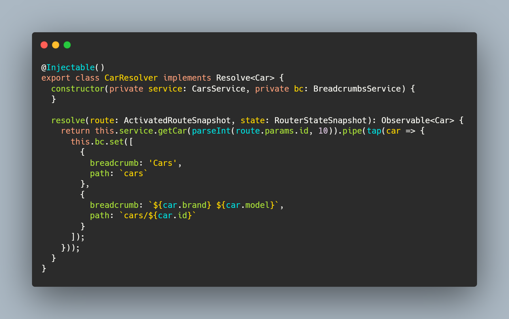
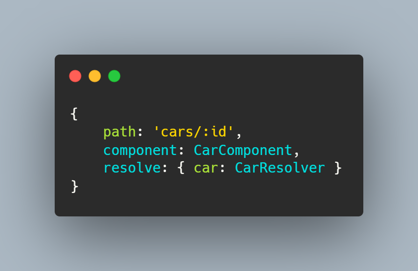
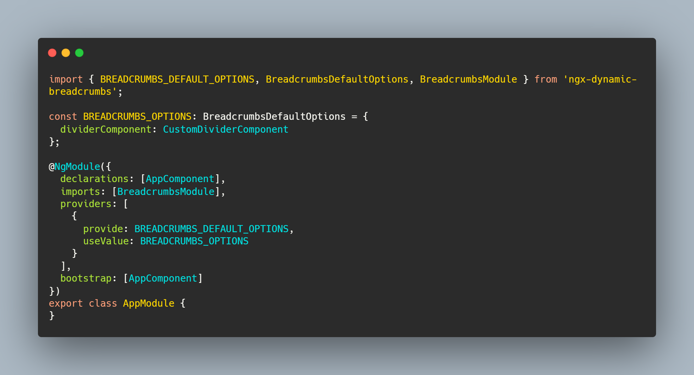

# ngx-dynamic-breadcrumbs
### Angular breadcrumbs

## Install

Run `npm i ngx-dynamic-breadcrumbs` to install.

## Usage
1) Import BreadcrumbsModule into your root module.

2) Create a resolver, inject BreadcrumbsService.
   If you need some data from back-end, fetch it, and using rxjs tap operator, set breadcrumbs array. If you want to hide breadcrumbs for specific routes, use clear() method of BreadcrumbsService.

3) Add the resolver to route

## Customization

It is possible to customize a divider:

